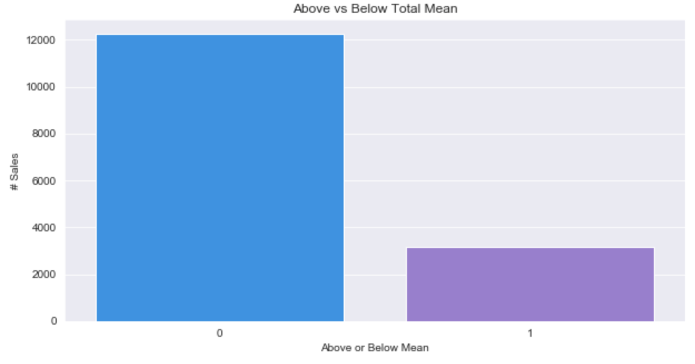
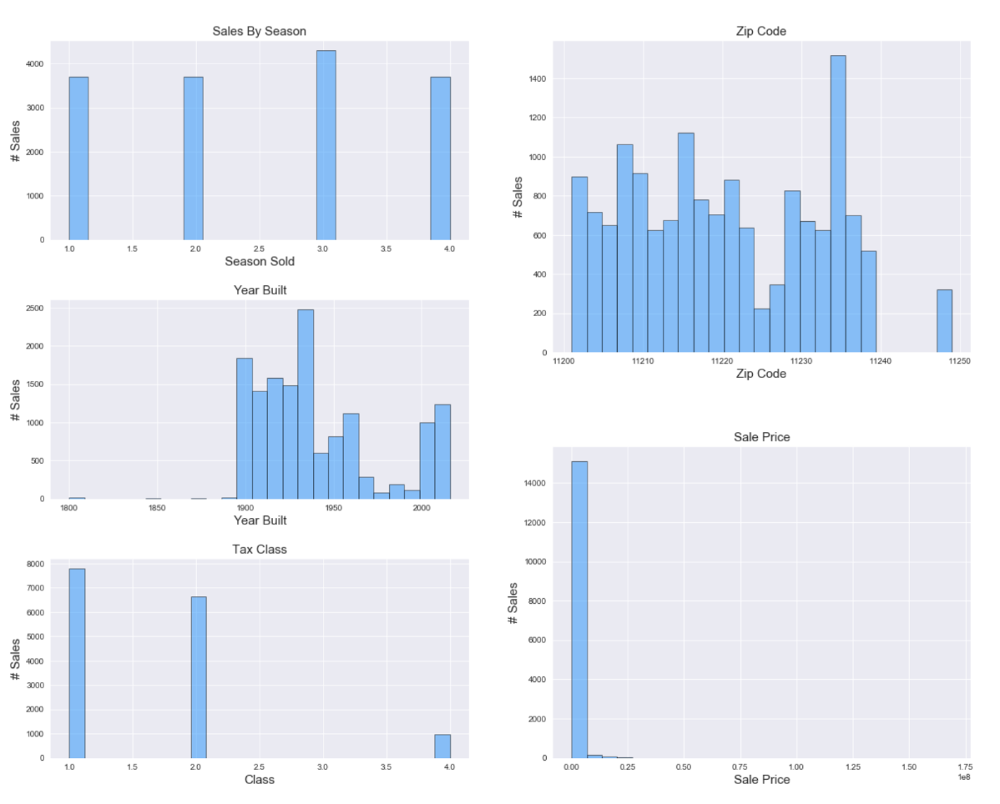
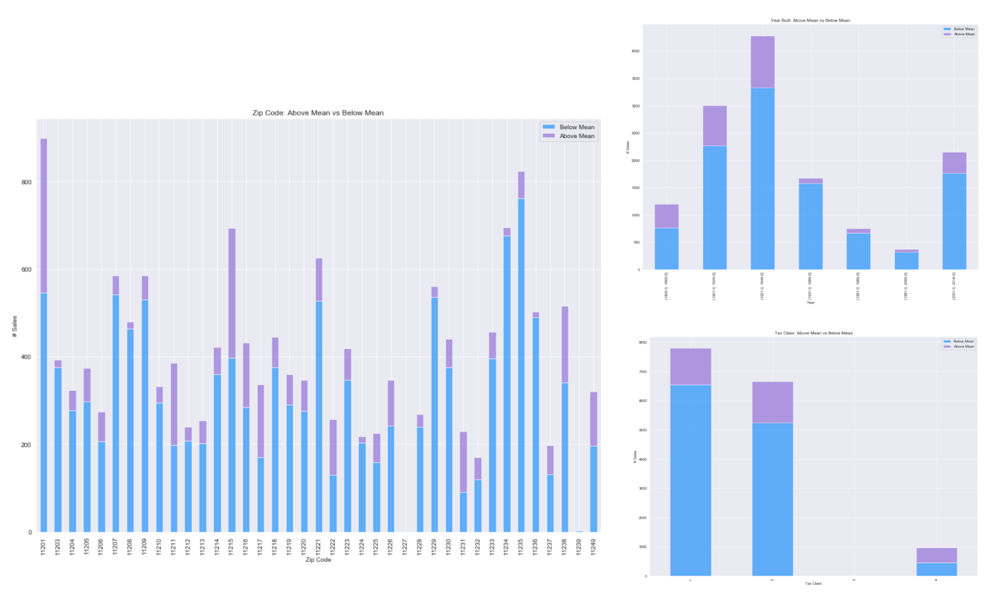

# Classification Project

- [Data](#Data) 
- [EDA](#EDA)
- [Modeling](#modeling)
    - [Choosing The Model](#ModChoice)
    - [Interpretation of the Model](#ModInterp)
- [Conclusions](#Conclu)
- [Next Steps](#Future)

## Project Goals
The aim of this project is to determine if a house will sell for above or below average price, to tell whether or not it was overpriced.

## Data 
### Source
I obtained my data from [NYCOpenData](https://opendata.cityofnewyork.us/). I used their API to gather data on housing sales, and chose to move forward with housing sales in Brooklyn in 2015 (the most recent year they had).

### Features
The data came with lot of great information, but not everything was in a useable format. Some of the features that I looked into for this model were:
- Borough
- Block
- Building Class
- Tax Class
- Apartment Number
- Zip Code
- Number of Residential Units
- Number of Commercial Units
- Land sq ft
- Gross sq ft
- Year Built
- Sale Date
- Address

## EDA <a name="EDA"><\a>
A quick look at the number of houses below and above the mean shows there is a large class imbalance in this data.

I then had a look at the distribution of sales by season, year built, tax class and zip code. I then broke it down by above/below mean to visualize whether or not there was a difference based on the variables selected.

## Modeling 
### Choosing The Model
