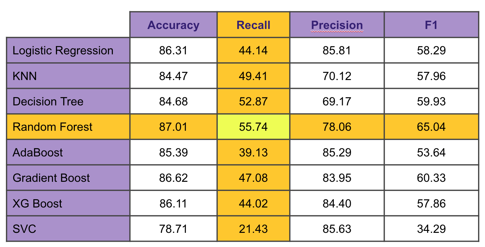
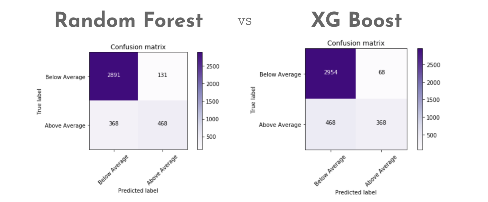
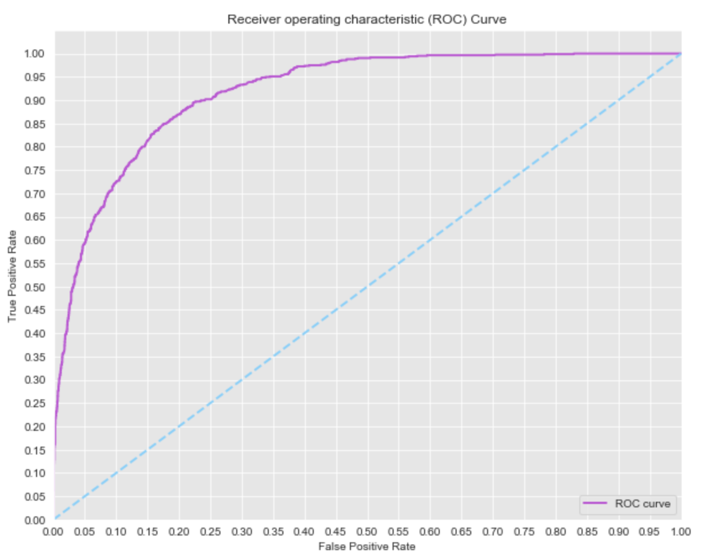
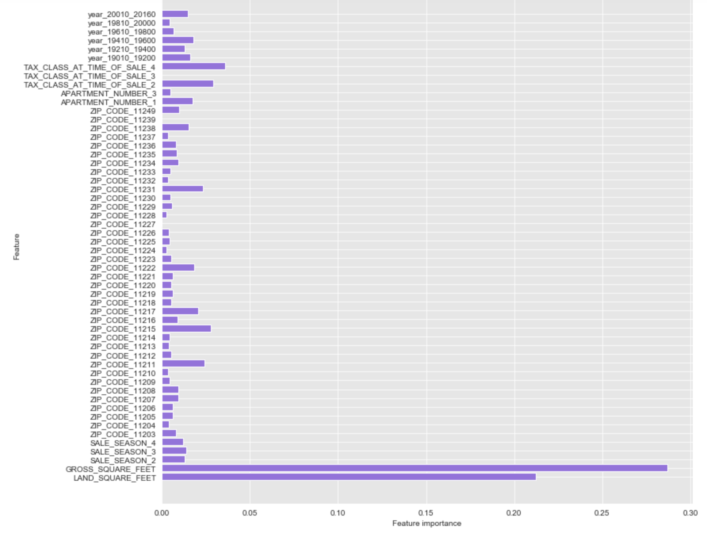

# Classification Project

- [Data](#Data) 
- [EDA](#EDA)
- [Modeling](#modeling)
- [Conclusions](#concl)

## Project Goals
The aim of this project is to determine if a house will sell for above or below average price, to tell whether or not it was overpriced.

## Data 
### Source
I obtained my data from [NYCOpenData](https://opendata.cityofnewyork.us/). I used their API to gather data on housing sales, and chose to move forward with housing sales in Brooklyn in 2015 (the most recent year they had).

### Features
The data came with lot of great information, but not everything was in a useable format. Some of the features that I looked into for this model were:
- Borough
- Block
- Building Class
- Tax Class
- Apartment Number
- Zip Code
- Number of Residential Units
- Number of Commercial Units
- Land sq ft
- Gross sq ft
- Year Built
- Sale Date
- Address

## EDA 
A quick look at the number of houses below and above the mean shows there is a large class imbalance in this data.

I then had a look at the distribution of sales by season, year built, tax class and zip code. I then broke it down by above/below mean to visualize whether or not there was a difference based on the variables selected.

## Modeling 
### Choosing The Model
I trained a number of models using scikit-learn, I optimized the hyperparamaters and took note of the accuracy, recall, precision and F1 score for each. This can be seen in the below table:

### Final Model Results
I chose Random Forest as my final model, as I wanted to optimize for minimal Type II errors (as I would rather the model incorrectly predicted a sale was above the mean than the opposite).
Below is a look at the confusion matrix, comparing Random Forest to the next closest model - XG Boost. You can see that there are fewer type II errors in the Random Forest model.

Below is the ROC curve for the chosen model, and also the feature importance.

Feature importance:

## Conclusions & Further Work 
- Random Forest was chosen as the best model, as it had the highest accuracy and lowest type II errors. Plus the ability to interperet the model coupld help expand on this project in the future.
- I would like to expand on this by including more boroughs in the dataset and include additional variables such as crime and school district.
- The ultimate goal is to have a model that could help buyers determine whether or not a property purchase is 'good value'.
